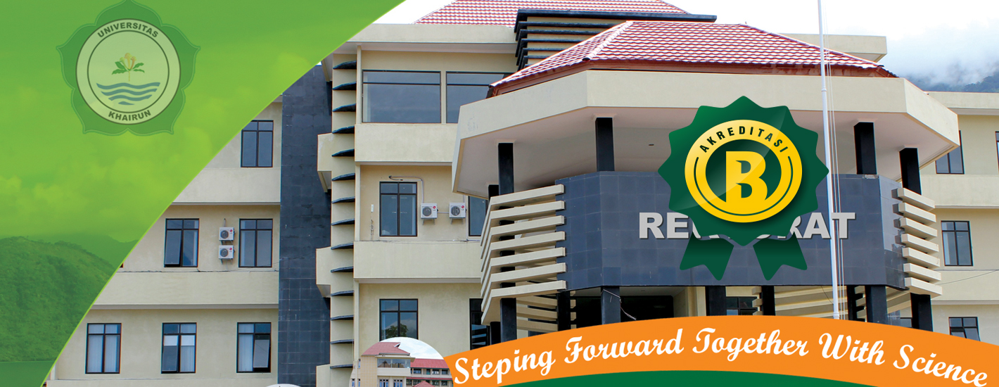

<p align="center">
  
</p>

<p align="center">
  <a href="#"></a>
  <a href="#"></a>
  <a href="#"></a>
  <a href="#"></a>
</p>

# Perbasi Maluku Utara — CMS

Website CMS profil **Persatuan Bola Basket Indonesia (Perbasi) Maluku Utara**. Sistem ini mengelola konten organisasi, data tim, atlet, pelatih, wasit, dan pengurus di seluruh kabupaten/kota Maluku Utara.

---

## Fitur Utama

- **Manajemen Konten**: Berita, pengumuman, halaman statis, dan galeri foto.
- **Manajemen Tim & Atlet**: Data distrik, tim, pemain, pelatih, official, dan wasit *(dalam pengembangan)*.
- **Manajemen Media**: Upload dan kelola berkas gambar & dokumen via Laravel File Manager.
- **Manajemen Menu**: Susun menu navigasi secara dinamis (drag & drop).
- **Komentar**: Moderasi komentar pada konten.
- **Pengaturan Umum**: Konfigurasi nama situs, logo, dan kontak.
- **Autentikasi & Hak Akses**: Login admin dengan reCAPTCHA.
- **Desain Responsif**: Antarmuka publik dan admin yang mobile-friendly.

---

## Tech Stack

| Layer       | Teknologi                                      |
|-------------|------------------------------------------------|
| Backend     | PHP 8.2+, Laravel 11.9                         |
| Frontend    | Blade, Tailwind CSS, Alpine.js, Vite           |
| Database    | MySQL                                          |
| Web Server  | Nginx                                          |
| Media       | Intervention Image, Laravel File Manager       |
| Storage     | Local / AWS S3                                 |
| UI Extras   | SweetAlert2, Laravel Notify, reCAPTCHA         |

---

## Arsitektur Sistem

```
app/Http/Controllers/
├── Auth/                  # Autentikasi
├── FrontEndController.php # Halaman publik
├── PostsController.php    # Berita & artikel
├── GalleriesController.php
├── MenuController.php
├── ThemeController.php
└── ...                    # Controller backend lainnya

resources/views/
├── themes/                # Tampilan publik (multi-tema)
├── auth/                  # Halaman login
└── backend/               # Dashboard admin

routes/
├── web.php                # Rute frontend publik
├── auth.php               # Rute autentikasi
└── backend.php            # Rute dashboard admin
```

---

## Database — Model Utama

**Sudah ada:**
- `users`, `categories`, `posts`, `posts_categories`, `comments`
- `galleries`, `galleries_meta`
- `general_settings`, `menus`, `menu_items`, `pages`, `themes`, `media`

**Dalam pengembangan:**
- `districts` — Kabupaten/kota anggota
- `teams` — Tim basket
- `coaches` — Pelatih tim
- `players` — Atlet/pemain
- `officials` — Pengurus tim
- `referees` — Wasit

---

## Instalasi Localhost

### Prasyarat
- PHP >= 8.2
- Composer
- Node.js & npm
- MySQL

### Langkah

```bash
# 1. Clone repositori
git clone <url-repositori>
cd perbasi_malut

# 2. Install dependensi PHP
composer install

# 3. Salin & konfigurasi .env
cp .env.example .env
php artisan key:generate

# 4. Sesuaikan .env (database, app name, dll)
# DB_DATABASE=perbasi_malut
# DB_USERNAME=root
# DB_PASSWORD=

# 5. Migrasi & seed database
php artisan migrate --seed

# 6. Buat symbolic link storage
php artisan storage:link

# 7. Install dependensi frontend & build
npm install
npm run dev

# 8. Jalankan server
php artisan serve
```

Akses:
- **Frontend**: `http://localhost:8000`
- **Admin**: `http://localhost:8000/cms/cp/login`

---

## Instalasi Hosting (cPanel)

1. Upload seluruh folder Laravel ke direktori di luar `public_html` (misal: `/home/username/perbasi_malut/`).
2. Pindahkan isi folder `public/` ke `public_html/`.
3. Edit `public_html/index.php`:

```php
// Ubah path menjadi:
require __DIR__.'/../perbasi_malut/vendor/autoload.php';
$app = require_once __DIR__.'/../perbasi_malut/bootstrap/app.php';
```

4. Konfigurasi `.env`:

```env
APP_NAME="Perbasi Maluku Utara"
APP_URL=https://namadomain.com

DB_CONNECTION=mysql
DB_HOST=localhost
DB_PORT=3306
DB_DATABASE=nama_database
DB_USERNAME=user_database
DB_PASSWORD=pass_database
```

5. Buat symbolic link storage:

```bash
ln -s /home/username/perbasi_malut/storage/app/public /home/username/public_html/storage
```

---

