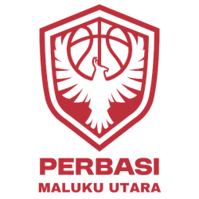

<p align="center">
  
</p>

<p align="center">
  <a href="#"></a>
  <a href="#"></a>
  <a href="#"></a>
  <a href="#"></a>
</p>

# Perbasi Maluku Utara

Website profil **Persatuan Bola Basket Indonesia (Perbasi) Maluku Utara**. Sistem ini mengelola konten organisasi, data tim, atlet, pelatih, wasit, dan pengurus di seluruh kabupaten/kota Maluku Utara.

---

## Fitur Utama

- **Manajemen Konten**: Berita, pengumuman, halaman statis, dan galeri foto.
- **Manajemen DPD, Klub, Atlet, Pelati, Wasit & Official**: Data distrik, tim, pemain, pelatih, official, dan wasit.
- **Manajemen Media**: Upload dan kelola berkas gambar & dokumen via Laravel File Manager.
- **Manajemen Menu**: Susun menu navigasi secara dinamis (drag & drop).
- **Autentikasi & Hak Akses**: Login admin dengan reCAPTCHA.
- **Desain Responsif**: Antarmuka publik dan admin yang mobile-friendly.

---

## Tech Stack

| Layer       | Teknologi                                      |
|-------------|------------------------------------------------|
| Backend     | PHP 8.2+, Laravel 11.9                         |
| Frontend    | Blade, Tailwind CSS, Alpine.js, Vite           |
| Database    | MySQL                                          |
| Web Server  | Nginx                                          |
| Media       | Intervention Image, Laravel File Manager       |
| Storage     | Local / AWS S3                                 |
| UI Extras   | SweetAlert2, Laravel Notify, reCAPTCHA         |

---

## Instalasi Localhost

### Prasyarat
- PHP >= 8.2
- Composer
- Node.js & npm
- MySQL

### Langkah

```bash
# 1. Clone repositori
git clone <url-repositori>
cd perbasi_malut

# 2. Install dependensi PHP
composer install

# 3. Salin & konfigurasi .env
cp .env.example .env
php artisan key:generate

# 4. Sesuaikan .env (database, app name, dll)
# DB_DATABASE=perbasi_malut
# DB_USERNAME=root
# DB_PASSWORD=

# 5. Migrasi & seed database
php artisan migrate --seed

# 6. Buat symbolic link storage
php artisan storage:link

# 7. Install dependensi frontend & build
npm install
npm run dev

# 8. Jalankan server
php artisan serve
```